# GatoCaffeinato - O Café dos Gatos ☕🐾

Bem-vindo ao **GatoCaffeinato**, um site temático que combina duas paixões: **gatos** e **café**. Estamos em construção e ainda ajustando alguns detalhes, mas já temos bastante conteúdo e funcionalidades prontas para você explorar. Fique ligado, pois em breve nosso site estará ainda mais interativo e com novas opções de serviços!

## 🚧 Em Construção

Atualmente, estamos trabalhando nas seguintes funcionalidades:
- Testes em andamento para as áreas de **admin** e **sales** (muito mais ideias que vierem).
- Algumas páginas estão sendo ajustadas para integrar melhor ao nosso tema de café e gatos.
- Logo mais, essas funcionalidades estarão totalmente integradas ao site!

---

## 🚀 Páginas do Site

Abaixo estão as páginas principais do GatoCaffeinato. Cada uma tem uma descrição breve e você pode visualizar as capturas de tela de como cada uma é apresentada.

### 1. **Página Inicial** (`index.html`)
A página inicial é o ponto de partida para explorar o GatoCaffeinato. Aqui, você encontra uma visão geral do nosso site e pode navegar para outras seções.

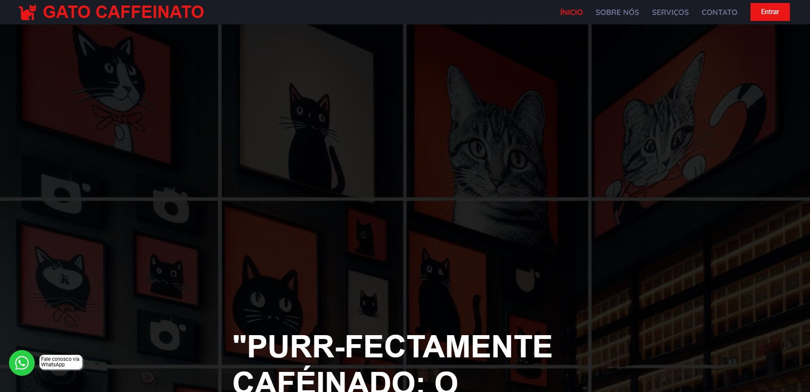

### 2. **Sobre** (`about.html`)
Aqui você conhece mais sobre nós, nossa missão e como a ideia de unir gatos e café se tornou realidade.

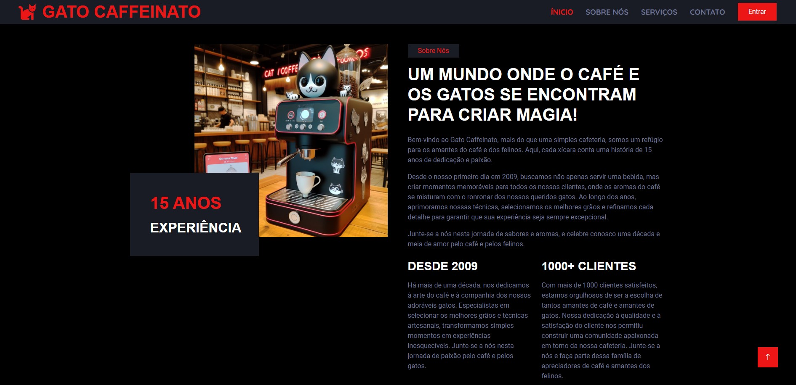

### 3. **Contato** (`contact.jpg`)
Tem alguma dúvida ou sugestão? A página de contato é onde você pode nos enviar suas mensagens diretamente.

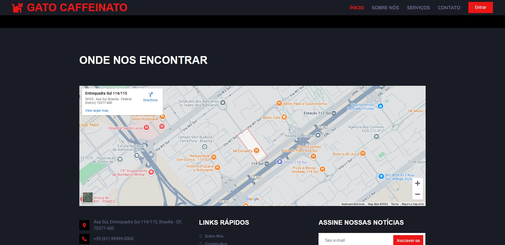

### 4. **Formulários** (`forms.jpg`)
Aqui você encontra formulários para se registrar, enviar feedback ou interagir com nossa plataforma de maneira personalizada.

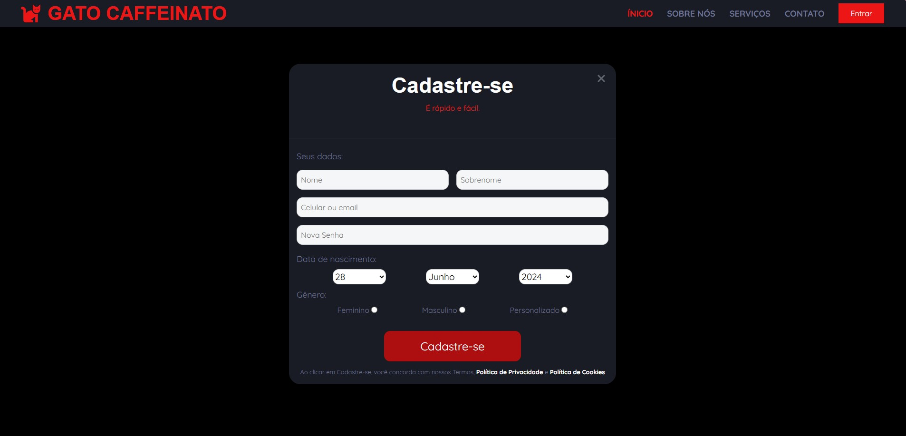

### 5. **Login** (`login.html`)
Página dedicada para que usuários possam fazer login e acessar áreas exclusivas do GatoCaffeinato.

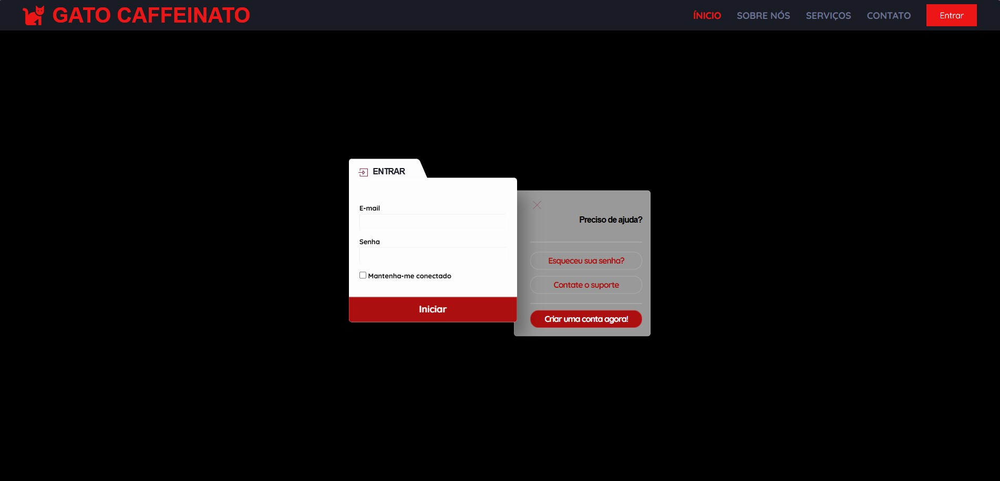

### 6. **Login Administrativo** (`loginad.html`)
Área exclusiva para administradores, onde é possível gerenciar configurações e dados do GatoCaffeinato.

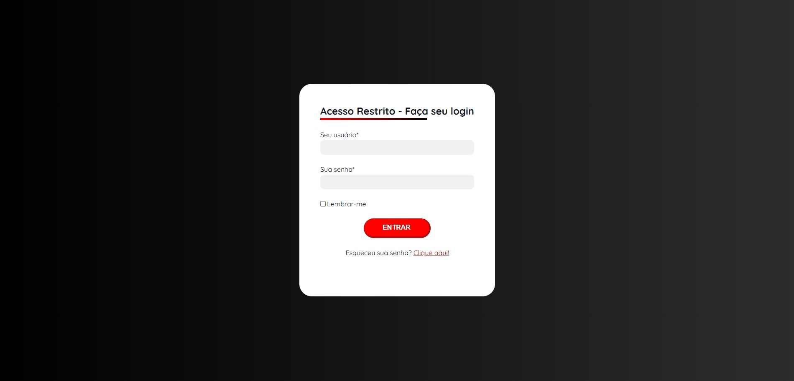

### 7. **Serviços** (`service.jpg`)
Detalhamento dos nossos serviços relacionados a café e gatos, incluindo informações sobre lojas, eventos e muito mais.

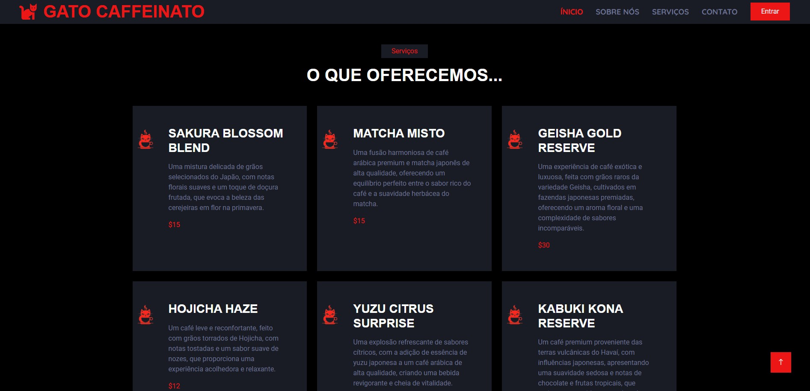

### 8. **Suporte** (`support.html`)
Precisa de ajuda? A página de suporte oferece respostas para perguntas frequentes e uma área para você encontrar mais informações.

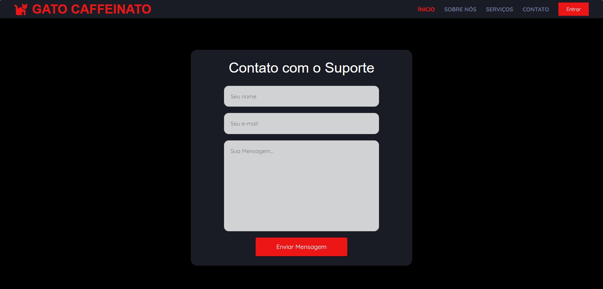

### 9. **Termos e Condições** (`terms-and-conditions.jpg`)
Aqui você encontra os termos de uso do GatoCaffeinato, definindo as regras para navegação e utilização do nosso site.

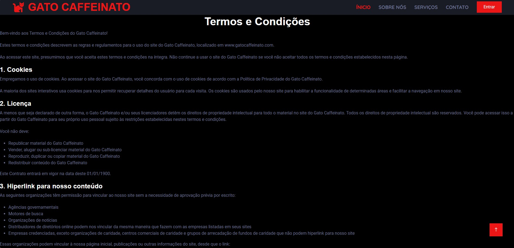

### 10. **Página de Agradecimento** (`thanks.html`)
Após completar algumas ações, como enviar formulários, você será direcionado para esta página de agradecimento.

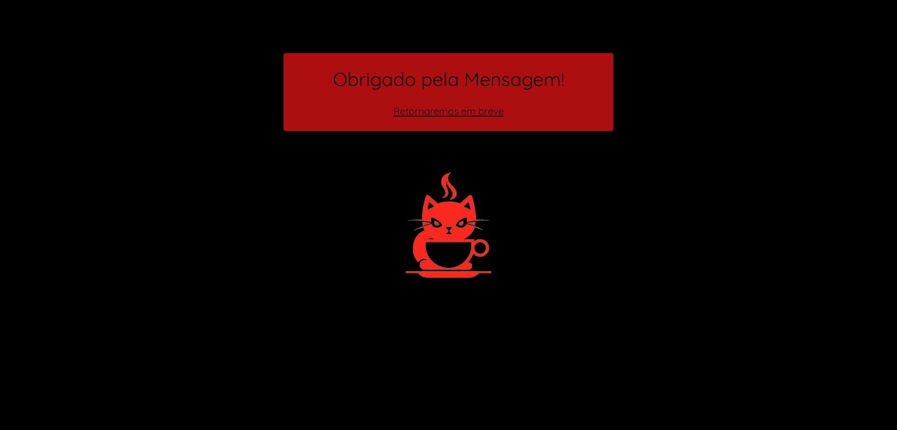

### 11. **Página de Estoque** (`stock.html`)
O sistema de gerenciamento de estoque do GatoCaffeinato está totalmente funcional! Ele permite o controle e registro de produtos com facilidade, incluindo quantidades, preços e categorias, garantindo uma experiência organizada e eficiente para os administradores.

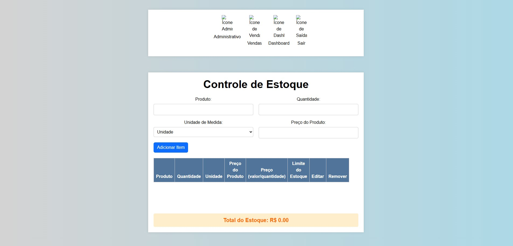

### 12. **Controle de Vendas** (`sales.html`)
Aqui você encontra o sistema de controle de vendas, com a tabela que exibe as vendas realizadas, e os dashboards atualizados.

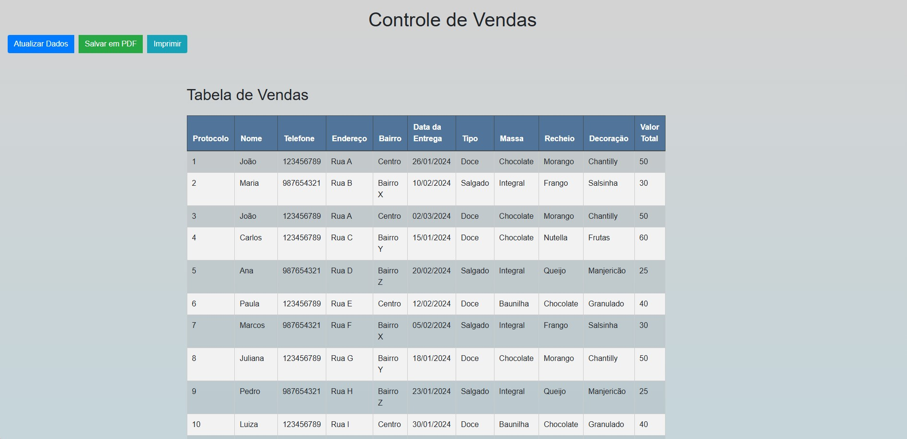

---

## 🗂 Estrutura de Pastas

### 1. **CSS** 
Contém todos os estilos necessários para o visual do site. Inclui arquivos como:
- `style.css`: O estilo principal para o layout do site.
- `responsive.css`: Ajustes para garantir que o site seja visualizado corretamente em dispositivos móveis.
- `reset.css`: Reset de estilos para garantir consistência entre navegadores.

### 2. **Imagens**
Aqui estão as imagens utilizadas no site, como fotos de fundo, equipe, depoimentos, entre outras.

### 3. **JS**
Arquivos de JavaScript para a interatividade do site. Inclui arquivos como:
- `login.js`: Funcionalidades para o login de usuários.
- `main.js`: Script principal para interação com a página.

### 4. **Lib**
Pastas com bibliotecas externas utilizadas no projeto, como:
- **Owl Carousel**: Para criar carrosséis de imagens e depoimentos.
- **WOW.js**: Para animações de rolagem na página.
  
### 5. **SCSS**
Estilos em SCSS, uma forma mais organizada de escrever CSS, que será compilado para os arquivos de estilo do site.

---

## 💡 Próximos Passos

- **Integração de Funcionalidades**: Continuaremos integrando funções administrativas como **admin** e **sales**.
- **Expansão do Conteúdo**: Novas seções e serviços estão sendo criados para enriquecer ainda mais a experiência de nossos visitantes.
- **Testes e Ajustes Finais**: A página continuará em construção, e testaremos as funcionalidades de maneira contínua para garantir um site fluido e livre de erros.

---

## 📄 Licença

Este projeto está licenciado sob a Licença XYZ. Consulte o arquivo LICENSE para mais detalhes.

---

## 🐱☕ Agradecemos pela sua visita!

Fique à vontade para explorar o site e aguarde as novidades que estão por vir. GatoCaffeinato está sempre em evolução, assim como o nosso amor por gatos e café!
